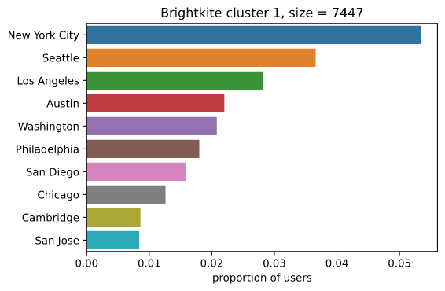

**Why do friendships matter?**

Our society tends to place an emphasis on romantic relationships, and we think that just finding that right person will make us happy and fulfilled. But [research](https://onlinelibrary.wiley.com/doi/abs/10.1111/pere.12187) shows that friends are actually even more important to our psychological well-being, especially over the course of our lifes. Friendships have a huge impact on our mental health and happiness. Good friends relieve stress, provide comfort and joy, and prevent loneliness and isolation. Developing close friendships can also have a powerful impact on your physical health. Friends are even tied to longevity, since a study from [Harvard](https://news.harvard.edu/gazette/story/2017/04/over-nearly-80-years-harvard-study-has-been-showing-how-to-live-a-healthy-and-happy-life/), conducted over 80 years, found that maintaining a rich network of friends can significantly increase your life. They even state that ["Loneliness is as powerful as smoking or alcoholism"](https://www.youtube.com/watch?v=8KkKuTCFvzI&feature=emb_title), meaning that a lack of social connections may pose a severe a risk to your health. But you can't make friendships out of thin air. Many of us struggle to meet people and develop quality connections. Whatever your age or circumstances, it’s never too late to make new friends and greatly improve your social life, emotional health, and overall well-being. 

**What would your approach to making new friends be?** 

There are countless psychological guides on how to make friends. And undoubtedly this is an essential aspect when approaching new people. But what if it's not just your social skills that determine whether you make friends? What if you could multiply your chances of making friends and vastly increase your friendship network by moving to a certain place? At a certain time of the year?

Our research is concerned with exactly these external factors that influence our social network. We have looked at two **location-based social network** datasets. Location what? Location-based social networks are social networks that use GPS data to locate you and that let you broadcast your location and other content from your mobile device. So to give an example: Imagine you travel to London for business. You know people there, but you haven't had the chance to send them a message. However, you are connected with them on Foursquare, one of the biggest location-based social networks. All you have to do when your train arrives is to _checkin_ to London's train station when you arrive. All your contacts will immediately know you have arrived and suddenly, they begin to contact you saying “Hey there, I didn't know you were in town. Let's meet up!.” 

There are some more location-based social networks, like [Gowalla](https://en.wikipedia.org/wiki/Gowalla) and [Brightkite](https://en.wikipedia.org/wiki/Brightkite). Unfortunately those two no longer appear to be in operation, however Gowalla announced a potential comeback for 2021. Nevertheless from the time when they were active, [Gowalla](https://snap.stanford.edu/data/loc-Gowalla.html) and [Brightkite](https://snap.stanford.edu/data/loc-Brightkite.html) collected their user's data and made it publicly available. These users have checked in to various locations all over the world between _April 2008_ and _October 2010_. For each check-in, we know the geographical location, the exact time, the user and all the friends of the user. Based on these checkins, we could compute the home location of each user and whether or not a check-in was a visit to a friend or not. We will use this data as an unconventional approach to investigate friendship across time and space, providing insights about the external factors that determine someone's social circle, like the place of residence and the time of the year.

There is nothing more to say in this introduction than: buckle up, sit back, and get ready to get answers to questions like "Where are people best connected? At what time do I make the most friends? Where do I find the most intense friendships?".

Let's start inspecting the home locations of our users. To calculate it, we discretised the world in 25x25 km cells, took all the check-ins of each user and calculated the home location as the average of all check-ins in the most frequently visited cell. This gives us a [85% accuracy of the true user's home location](https://cs.stanford.edu/people/jure/pubs/mobile-kdd11.pdf).



We can see that the users are from all over the world, but a majority lives in either the US or Europe. To be precise, 81281 users live in the US and 76497 somewhere else. This is why in our later analysis, we will make a distinction between US and non-US users in order to not bias our results.

<h2>The spatial dimension</h2>

There are plenty of spatial factors that can determine how many friends you have. Do you live in a rural or urban area? How well are the people in general connected at your place of residence?

**Are inhabitants of urban cities more likely to have friends than inhabitants of rural areas?**

We will start with investigating whether inhabitants of urban cities are more likely to have friends than inhabitants of rural areas. In order to do so, we have to define what a city is. The [UN Statistical Commission](https://blogs.worldbank.org/sustainablecities/how-do-we-define-cities-towns-and-rural-areas) endorsed the Degree of Urbanization stating that cities are settlements which have a population of at least 50,000 inhabitants in contiguous dense grid cells (>1,500 inhabitants per km^2). Applying this criteria, we are left with 1256 non-US cities and 328 US cities.



The next step is to compute whether a user lives in a city, which we will do by checking the distance to all cities of the home country of the user. Intuitively, the user lives in a city if the distance to at least one of them is smaller than the expansion of the respective city. Afterwards, we can compute the amount of friends per urban and rural user. For the **Non-US citizens** we get the following table of results:



First, we can observe that in general more people live in rural areas than in cities. Each person has at least one friend and 75% at least 9 or 10. The difference arises only in the maximum number of friends. Some users that live in cities have an incredible high number of friends, i.e. up to 1458. For users that live in rural areas, the maximum number of friends is 1066. This indicates that living in a city outside the US does not necessarily increase your chances of having more friends! What about the US then? Should we move to the US if we want to increase the amount of friends we have?
<!---

-->

To get a first grasp how the situation looks like for **US citizens**, we look at the table of results.



Again, more people live in rural areas than in cities and the characteristics differ only in the maximum number of friends, which are higher for urban users. 
Living in the US or not, urban users have the same amount of friends than rural users. So when deciding where to live to increase your chances of having more friends, it does not matter whether you move to a rural or urban area. 
<!---

-->
--------------------------------------

**How well are people in the US connected?**

We have discovered that the number of friends does not differ much between urban and rural inhabitants. An interesting follow up would be to look at how the friendship network is structured, is the network graph limited to a number of smaller subgraphs, corresponding to the geographical location of users? Or are the users of the network more strongly connected across space?

To investigate this question we used a community detection algorithm on the friendship graph. There are a number of different community detection algorithms, however, due to the size of the datasets we had to restrict ourselves to algorithms that are pretty fast. We settled for the [Walktrap algorithm](http://arxiv.org/abs/physics/0512106). The algorithm tries to find densely connected subgraphs by performing random walks. The idea is that short random walks tend to stay in the same community.

We also decided to only use US checkins. This is because we were mostly interested in seeing how cities are distributed in these clusters and introducing country borders would make things much more complicated. 

What we discovered is that, for both datasets, the largest cluster, with roughly 25% of users, had a pretty even distribution of cities. There was no city clearly dominating. What's interesting about this is that many users are quite tightly connected, despite great distances separating them. Thus, it seems that the social networks really do serve to eliminate great spatial distances limiting our ability to connect with other people. This means that for people looking to make friends in different places, joining a social network is probably a great idea since you end up connected to people living in the entire country, usually by only a few degrees of separation. The largest cluster for the Brightkite dataset can be seen below.



However, for the smaller clusters (100-2000 users) there was almost always one city or state clearly dominating. Below are two geographically of these constrained clusters, where more than 40 % of users are from the same city/state. So the structure of the friendship graph is clearly dependent on the geographical location of the users, which was also concluded in the original paper in Figure 2A. This raises a number of questions which would have been interesting to investigate, given more time. For instance, it might be interesting to investigate the difference between users that end up in geographically restricted clusters, compared to those that end up in the larger, more spread out, clusters. Another interesting thing to investigate would be if inhabitants of certain cities are more likely to end up in isolated clusters. What we observed was that for the two largest cities in the US, New York and Los Angeles (although in gowalla Austin had more users), there did not seem to be any clusters isolated in the cities. Instead, both cities were strongly represented in almost all the larger clusters, while never completely dominating. Maybe this is an indication that users living in these two cities are more connected with the rest of the country. Unfortunately, analysing the clusters was extremely computationally intensive, due to the size of the networks and having to find cities for all users, so we did not have the resources to conduct a rigorous investigation of these questions. But it might be interesting to look at more closely, given more time and resources.



The third largest cluster in the Brightkite dataset, which is dominated by users living in Denver and Boulder, CO.



The fifth largest cluster in the Brightkite dataset, which is dominated by users living in Phoenix, AZ.

--------------------------------------

TODO: Devrim: what about RQ4?
4. How does the interconnection between countries/continents differ? Does it depend on the language or religion?

**Non-US citizens**

**US citizens**

--------------------------------------

<h2>The temporal dimension</h2>

Next to the spatial dimension, there is the whole temporal aspect of friendship. When do people visit each other? And how often? Does it depend on whether they live in a city or not or on the current season?
We will start to dive into it by inspecting how often users visit each other. Remember, the period where the data was collected is between April 2008 and October 2010, so we will inspect how often users visited each other in this period.

**How often do users visit each other?**

As before we start with the behaviour of the **Non-US citizens**.



Interestingly enough we can notice that the distribution is approximately trimodal: most people visited their friends very rarely in those 2 1/2 years, between 0 and 500 times, some visited each other around 1000 times, and others even 1500 - 2000 times. This suggests that people have in general either loose or quite intense friendships. But does it depend on whether they live rural or urban?



Here we see quite clearly that there is a difference between people that live urban and those that live rural: users in cities visit each other more than users in rural areas! Moreover, we can say that most of the intense friendships are between people that live in cities, where people in rural areas have more sporadic friendships. Thus, if you prefer to have intense friendships, you should definitely consider moving to a city outside of the US. But wait, maybe it is the same pattern for the US? Let's look at all our **US citizens**.



There seems to be a similar pattern present for the users that live in the US: most of them have loose friendships, some are more intense and few are really profound. Again, we investigate which of these users live rural and which live urban.



Interestingly enough, tables seem to have turned: for US citizens, the more intense friendships are between users that live in rural areas, where urban users have more sporadic friendships.

Summing up we conclude that if you are a social butterfly and want to have as many loose friendships as possible, you should move to a rural area outside of the US or to a big city inside the US. However if you are interested in deep friendships, you should rather go to a city outside of the US or to the rural areas of the US.

**When do users visit each other?**

The question that is left unanswered is when do users visit each other? To investigate this we will divide each checkin that was a visit to a friend in four categories, one for each season: spring, summer, autumn and winter. The months _December to February are winter_, _March to May are spring_, _June to August summer_ and _September to November autumn_.
**Remark:** Remember our data collection starts in April 2008, so the values for winter and spring of 2008 are a bit underestimated. The data collection ended in October 2010, so there the values for autumn and winter will be underestimated. The most reliable year for interpretation will therefore be 2009, so we focus our conclusions on those.

Having divided the year into seasons, we group by user, year and season and count how often people visited their friends there. Common sense tells us of course, that people stay inside in winter and go out most in summer. Does this hypothesis hold for **users outside of the US**? 



For the year 2009 we can see that most people visited each other in spring and summer (median value of friend visits is 417.5 and 418, respectively), and fewer people went out in autumn and winter (median value of friend visits is 105 and 79, respectively). This is consistent with our hypothesis that people move more when it gets warm again, maybe it is a bit unexpected that people on average visit as much friends in spring as in summer. One last time, let's inspect the situation for the **US users**.



The same pattern can be found for the year 2009 for them: the median value for spring and summer is again higher than for autumn and winter.

Drawing a conclusion, we can state that you have the best chances to meet new people at spring or summer time.

--------------------------------------

<h2>What about you?</h2>
  
We completed our friendship journey through time and space! 
Thanks for keeping the ball rolling all this time. As a reward, here are all our results in a nutshell:

1. **Are inhabitants of urban cities more likely to have friends than inhabitants of rural areas?** 
No

2. **How well are people in the US connected?**
TODO Carl

3. TODO Devvis part

4. **How often do users visit each other?**
- people have loose friendships in the rural areas outside of the US or in big city inside the US
- people have deep friendships in the cities outside of the US or in the rural areas inside the US.

5. **When do users visit each other?** 
In spring and summer, the same everywhere in the world.

Interpreting these results against the background of how to increase your friend network as efficiently as possible, we state: wait for spring and summer, go to the well connected big cities and get to know as much people as possible. In the meantime, never forget:
 
> "When you live with an open heart, unexpected, joyful things happen." Oprah Winfrey 

